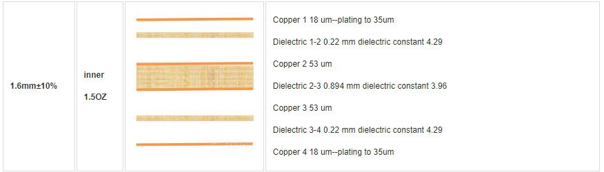
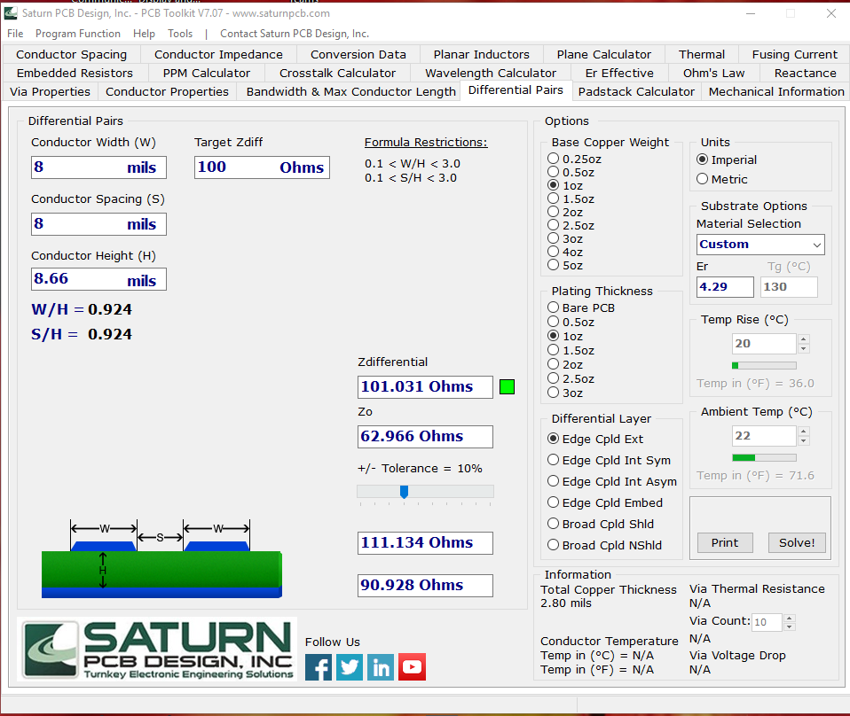

# au-ar-interface
machine vision and hdmi interface for alchitry labs au artix 7 fpga

## layer stackup
I use pcbway and this is the layer configuration from them that this board is based on. 

## hdmi impedance calcluation and design considerations
Saturn PCB Toolkit was used to calculate the necessary trace widths and spacing to achieve the 100 ohm differential impedance target of the HDMI specification.

